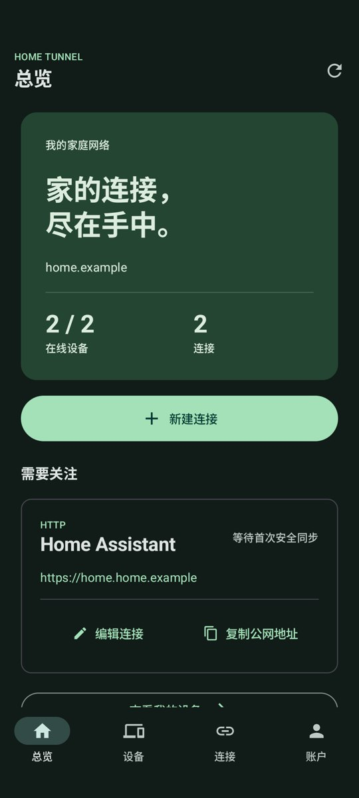

  
  <h1>Home Tunnel for Android</h1>
  
<strong>Manage your home devices and connections anywhere</strong>

  
 

  
<a href="README.md">简体中文</a> · <a href="https://zhanry.github.io/home-tunnel/">Website</a>

The 6.0 app introduces Overview, Devices, Services and Account. Android manages your home network remotely; tunnels run on your home computer or NAS.

## Install

Download `HomeTunnel-Android-6.0.1-arm64-v8a.apk` from [Releases](https://github.com/ZHanry/home-tunnel-android/releases/latest). Android 8.0+ on arm64 is supported. The APK uses the persistent project signing certificate and can update earlier versions signed with that certificate. Only the APK appears in release downloads.

6.0.1 fixes the `Caller-provided IV not permitted` login error. Update without uninstalling or clearing application data.

## Use

1. Enter your Home Tunnel console HTTPS address and account.
2. Select a computer or NAS in Devices to see its services.
3. Explicitly select a device when creating a connection, then enter an address reachable from it.
4. Search by name or address, edit a connection or copy its public address.

`127.0.0.1` refers to the selected computer or NAS. Signing out on the phone ends its management session while home tunnels continue running. The app follows the system theme and supports English and Simplified Chinese.

## Development

Use JDK 17, Android SDK 35 and the included Gradle Wrapper. Run `./gradlew test lint assembleDebug`. GitHub Actions builds official APKs with the protected release signing configuration; the private key is never committed.

[Building](docs/BUILDING.md) · [Releasing](docs/RELEASING.md) · [Release notes](docs/RELEASE_NOTES.md) · [Security](SECURITY.md) · [Project hub](https://github.com/ZHanry/home-tunnel)

