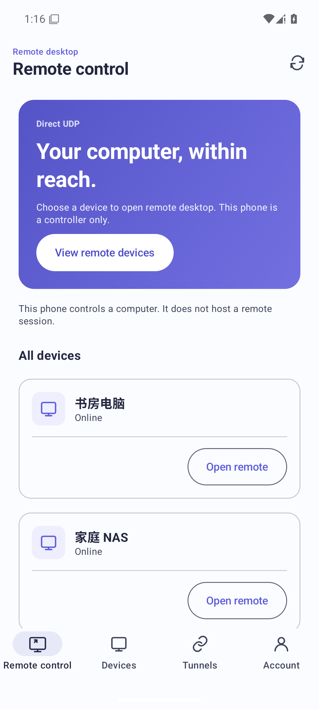
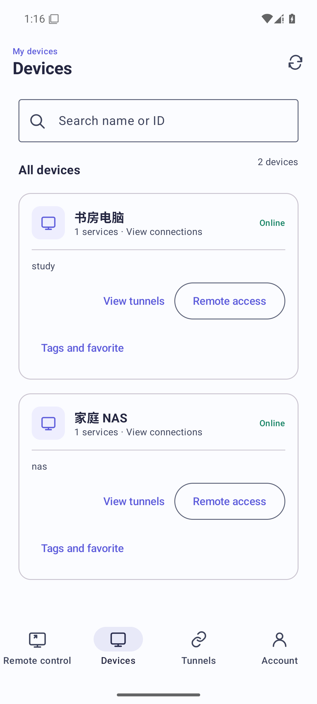

# Home Tunnel Android

**Manage your servers and home devices from Android**

[](https://github.com/ZHanry/home-tunnel-android/releases/latest) [](LICENSE)

[简体中文](README.md) · [Website](https://zhanry.github.io/home-tunnel/en/) · [Downloads](https://github.com/ZHanry/home-tunnel/blob/main/docs/DOWNLOADS.md) · [Quick start](https://github.com/ZHanry/home-tunnel/blob/main/docs/GETTING_STARTED.md)


The Android 8.0+ management app for Home Tunnel. Your phone controls devices and
connections; tunnels run continuously on a Windows/macOS/Linux computer or NAS.

The current version is **10.0.0**, using the verified same-source arm64-v8a / x86_64 native SDK from the 10.0.0 desktop client. Remote control implements authorized video/input, system audio playback, clipboard, files, monitor selection and bounded reconnect over direct UDP only. The server's TURN relay is for browser viewers. Microphone return is unavailable. Builds, signatures and development screenshot review do not establish final-package or physical-device acceptance; see the [release notes](docs/RELEASE_NOTES.md) and [capabilities and validation](docs/REMOTE_DESKTOP.md) for untested cases and owner waivers.

[Download signed 10.0.0 APK (arm64-v8a)](https://github.com/ZHanry/home-tunnel-android/releases/download/v10.0.0/HomeTunnel-Android-10.0.0-arm64-v8a.apk) · [x86_64 APK](https://github.com/ZHanry/home-tunnel-android/releases/download/v10.0.0/HomeTunnel-Android-10.0.0-x86_64.apk) · [Release, checksums and signature evidence](https://github.com/ZHanry/home-tunnel-android/releases/tag/v10.0.0)

- Save up to 20 encrypted server/account profiles with isolated request/cache state.
- TOTP/recovery-code sign-in, MFA setup, session revocation and one-time enrollment codes.
- Capability-based HTTP/TCP/UDP, SSH/RDP/RTSP presets and versioned administrator port settings.
- Device tags/favorites and batch pause/resume for up to 50 connections with per-item results.
- Account administration, status/audit views and redacted management diagnostics.

Tunnel management retains compatibility with server **7.0.0+**. Remote control should use a **10.0.0** server and desktop host advertising the required capabilities. Enter your own HTTPS origin, sign in and select an enrolled home device. Management discovery accepts an absent FRPS certificate while still
verifying HTTPS. Existing encrypted single-account state migrates on upgrade;
uninstalling can destroy local keys and is not required.

## Screenshots

Actual 10.0.0 Compose UI on an Android API 35 emulator, using a debug build and
explicit sample data. These show the remote-control entry and device list, not
final-APK or physical-device remote acceptance. [Capture provenance and hashes](docs/SCREENSHOTS.md).

 

Build with JDK 17 and Android SDK 35:

```sh
./gradlew test lint assembleDebug assembleDebugAndroidTest
python3 scripts/check-repository.py
```

Official releases retain the established Android signing identity pinned in
`release-signing-cert.sha256`. CI checks KeyStore and management UI on API 26/35.
Release assets retain checksums, SBOMs and signing/install evidence.

[Feature guide](docs/PLATFORM_FEATURES.md) · [API](contracts/README.md) · [Project](https://github.com/ZHanry/home-tunnel)
